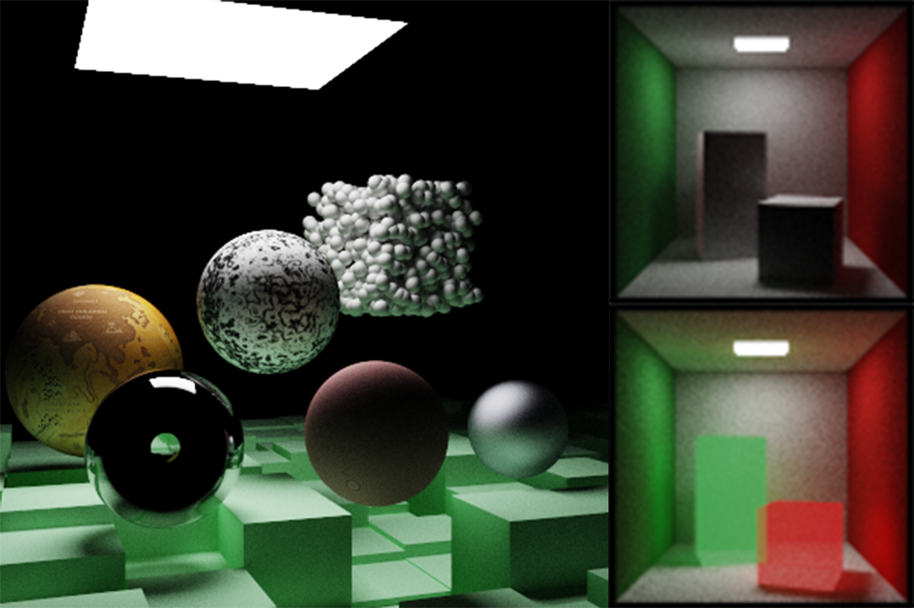
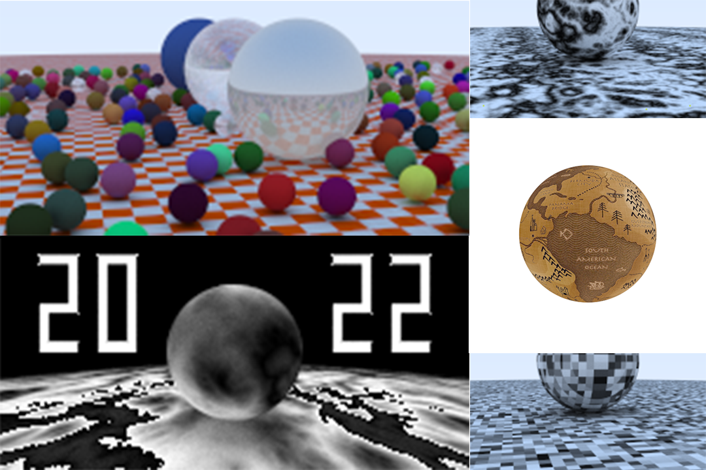

# Ray Tracing The Next Week

1. BVH (Bounding Volume Hierarchies)
2. Solid & Perlin Noise & Image Texture Mapping
3. Rectangles & Lights
4. HDR  & Tone Mapping (ACES Approximate)
5. Instance System
6. Volumes & Constant Medium

